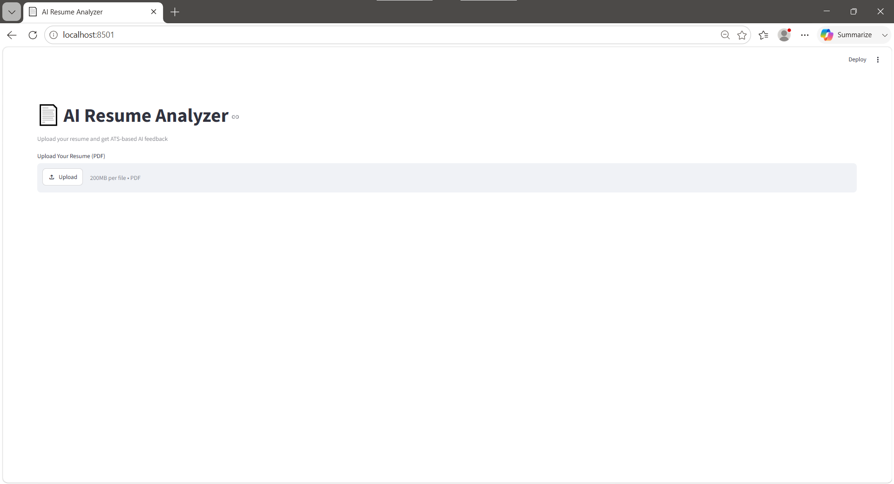
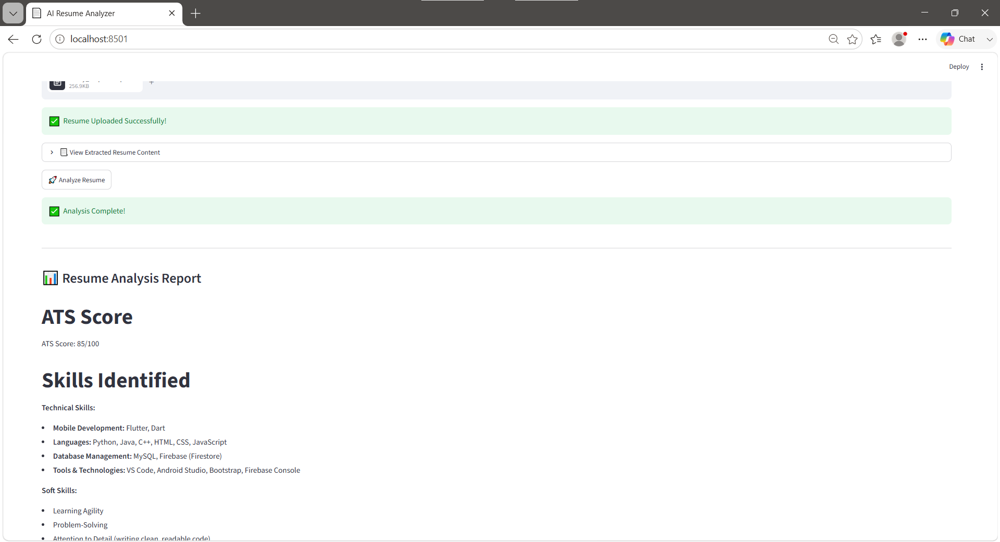

# AI Resume Analyzer 📄

An AI-powered Resume Analyzer built using Streamlit, Python, and Google Gemini AI.

## Features

* Upload Resume PDF
* Extract Resume Content
* ATS Score Analysis
* Skills Identification
* Strengths & Weaknesses Detection
* Suitable Job Role Recommendations
* Resume Improvement Suggestions
* Download Analysis Report

## Tech Stack

* Python
* Streamlit
* Gemini AI
* PyPDF2
* python-dotenv

## Project Structure

AI-Resume-Analyzer

├── app.py

├── requirements.txt

├── README.md

├── .gitignore

├── screenshots/

└── .env (Not Uploaded)

## Installation

### 1. Clone the Repository

```bash
git clone https://github.com/Lucky-Naik/AI-Resume-Analyzer.git
```

### 2. Install Dependencies

```bash
pip install -r requirements.txt
```

### 3. Create a .env File

```env
GEMINI_API_KEY=YOUR_API_KEY
```

### 4. Run the Application

```bash
streamlit run app.py
```

## Screenshots

### Home Page



### Analysis Page



## Author

Lucky Naik
